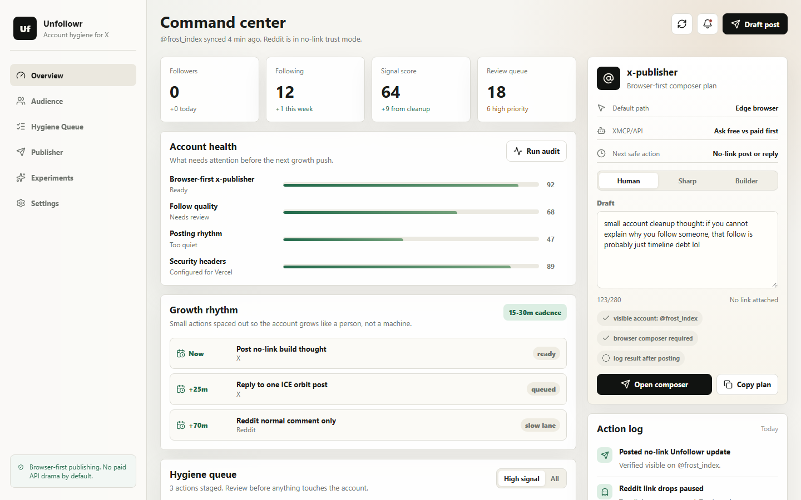

# Unfollowr — account hygiene for X

Grow like a person, not a bot. One dashboard for who you follow, what to post next, and what to clean up.



Health scores, a review queue for low-signal follows, a paced posting rhythm, and a composer that drafts in your tone and opens X's own composer. No paid API required.

**[Open the dashboard →](https://unfollowr-lake.vercel.app)** · React · TypeScript · Vite

---

## What's inside

- **Command center:** followers, following, signal score and review queue at a glance
- **Account health:** follow quality, posting rhythm and security checks, scored
- **Hygiene queue:** staged follow/unfollow actions you review before anything touches the account
- **Audience map** and **experiments** to see what's working
- **Publisher:** the [x-publisher](https://github.com/iice257/x-publisher) panel drafts in Human, Sharp or Builder tone and opens a browser composer link with a publish checklist
- **Action log** of everything done, and when

Publishing goes through the browser composer by default, so it works without X API access.

## Run it

```bash
npm install
npm run dev
```

`npm run build` type-checks and builds to `dist/`. Deployed on Vercel; see [SECURITY_AUDIT.md](SECURITY_AUDIT.md) for the headers and hardening.

## Built with

React 19, TypeScript, Vite, lucide-react.

MIT © [Kingsley Aremu](https://github.com/iice257)
